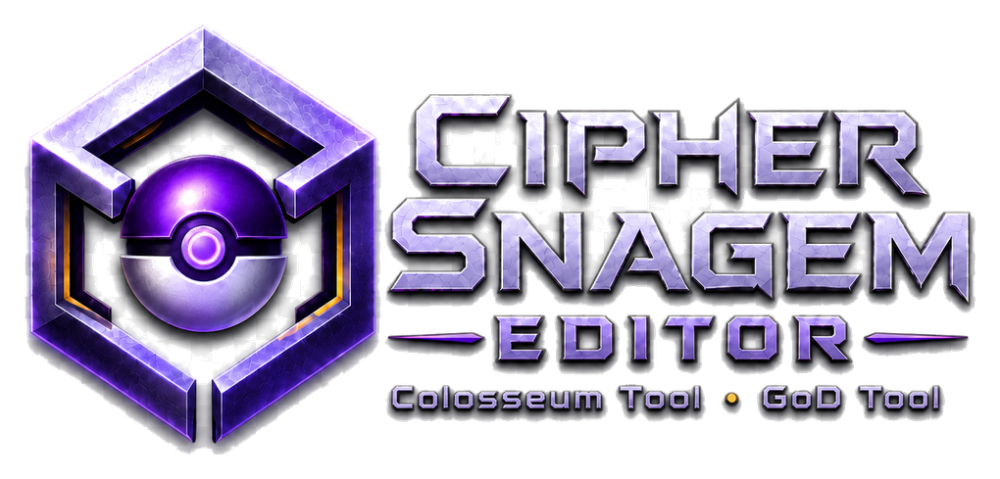
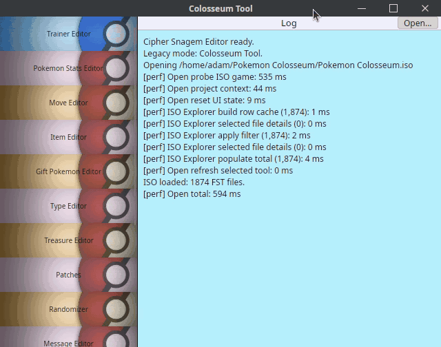
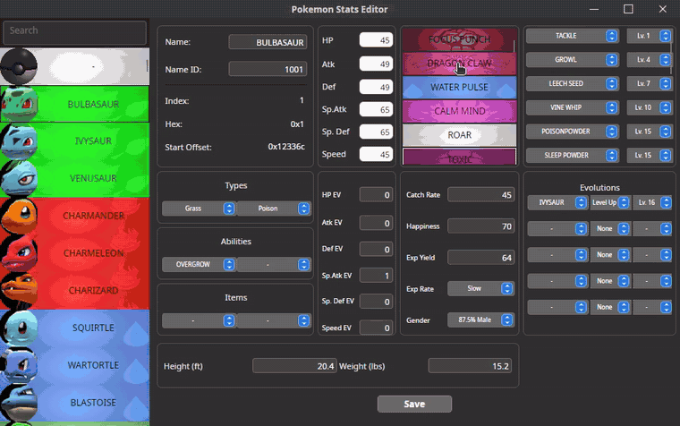
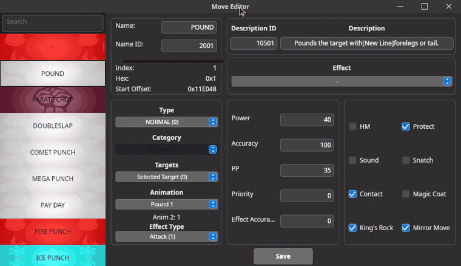
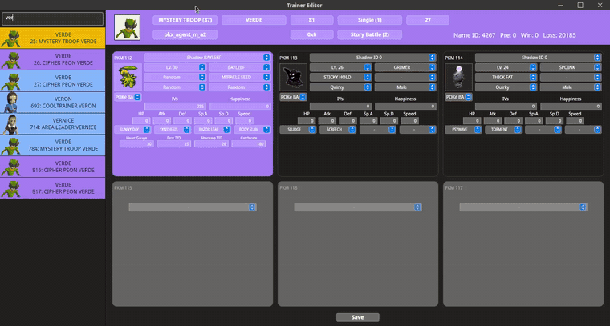

<p align="center">
  <a href="https://phlosion.com/">
    
  </a>
</p>

<h1 align="center">Cipher Snagem Editor</h1>

<p align="center">
  
  
  
  
</p>

Cipher Snagem Editor is a Windows-first, cross-platform .NET/Avalonia remake of
the legacy Pokemon Colosseum and Pokemon XD: Gale of Darkness modding tools from
the `Pokemon-XD-Code` project.

The repository contains one shared codebase and two desktop release targets:

- `Colosseum Tool` for Pokemon Colosseum.
- `GoD Tool` for Pokemon XD: Gale of Darkness.

The goal is preservation and practical parity with StarsMMD's original
Swift/macOS tools: familiar editor windows, equivalent data behavior, safe ISO
workspace flows, and repeatable rebuilds on modern Windows and Linux.

## 🎬 App Preview

<table>
  <tr>
    <td width="50%">
      
    </td>
    <td width="50%">
      
    </td>
  </tr>
  <tr>
    <td align="center"><strong>Workspace</strong></td>
    <td align="center"><strong>Pokemon stats</strong></td>
  </tr>
  <tr>
    <td width="50%">
      
    </td>
    <td width="50%">
      
    </td>
  </tr>
  <tr>
    <td align="center"><strong>Move editor</strong></td>
    <td align="center"><strong>Trainer editor</strong></td>
  </tr>
</table>

Animated previews adapted from the [Phlosion demo captures](https://phlosion.com/).

## ⬇️ Download

Most users should download a prebuilt package from the
[GitHub Releases page](https://github.com/AdamWentworth/CipherSnagemEditor/releases)
instead of cloning the source.

Quick choice:

- Windows: download the `windows-portable-x64.zip` for the tool you want.
- Ubuntu/Debian: download the `ubuntu-debian-x64.deb` for the tool you want.
- Other Linux: download the `linux-portable-x64.tar.gz` for the tool you want.

See [release packaging](docs/release-packaging.md) for the full release artifact
list, local packaging commands, and GitHub release workflow.

## 🌟 Original Work And Credit

This project exists because of the original **Gale of Darkness Tool** and
**Colosseum Tool** created by **Stars Momodu** / **@StarsMMD**.

The legacy project identifies the tools as:

- `GoD Tool` for Pokemon XD: Gale of Darkness
- `Colosseum Tool` for Pokemon Colosseum
- source repository: `https://github.com/PekanMmd/Pokemon-XD-Code.git`

Cipher Snagem Editor is not an attempt to erase or rebrand that work. It is a
Windows and cross-platform C# remake/fork effort built by studying the Swift
source, UI storyboards, data parsers, binary formats, and behavior of StarsMMD's
original tools.

## 📌 Scope

This repo is the stable legacy-editor parity line for Colosseum and XD editor
workflows. It is not intended to become a general model, VFX, Blender, map,
music, or audio authoring suite.

See [project scope](docs/scope.md) for supported workflows, editor coverage, and
out-of-scope boundaries.

## 🛠️ Development

Install the .NET 10 SDK, then run:

```powershell
dotnet build CipherSnagemEditor.slnx
dotnet test CipherSnagemEditor.slnx --no-build
```

See [testing](docs/testing.md) for local ISO fixture layout, parity probes,
Dolphin smoke checks, and deeper verification commands.

## 📸 Demo Media

Demo screenshots and videos can be generated from a local packaged Linux build
and a local Pokemon Colosseum ISO:

```bash
python3 tools/capture_demo_media.py \
  --app .local/cipher-package/opt/cipher-snagem-editor/CipherSnagemEditor.App \
  --iso "$HOME/Pokemon Colosseum/Pokemon Colosseum.iso"
```

The command writes native desktop window media under
`artifacts/demo-media/cipher-snagem-editor/`. Game files, extracted packages,
and generated media artifacts are local-only and ignored by git.

## 📚 Documentation

- [Project scope](docs/scope.md): supported editor workflows and boundaries.
- [Testing](docs/testing.md): build checks, tests, local fixtures, and smoke
  probes.
- [Release packaging](docs/release-packaging.md): tracked packaging recipes,
  ignored artifacts, and release builds.

## ⚖️ Legal And Data Hygiene

No Nintendo, Genius Sonority, or Pokemon game files belong in this repository.
Do not commit ISOs, extracted ISO contents, save files, generated CM Tool
workspaces, Dolphin user folders, or local reference dumps.

This repository carries GPL-2.0-only licensing metadata to remain compatible
with the legacy source. See [LICENSE](LICENSE).

Pokemon, Pokemon Colosseum, Pokemon XD: Gale of Darkness, and related names are
owned by their respective rights holders. This is an unofficial fan modding
tooling project.
